# Three.js Journey

## we created a webpack Server for three js local development

## Setup

Download [Node.js](https://nodejs.org/en/download/).
Run this followed commands:

```bash
# Install dependencies (only the first time)
npm install

# Run the local server at localhost:8080
npm run dev

# Build for production in the dist/ directory
npm run build
```

## learned about [Materials](https://threejs.org/docs/#api/en/materials/Material)

<br /><br/>

### creat a base scene with 3 moving object

```js
....

const material = new THREE.MeshBasicMaterial({color: 0x00f0f0})

const sphere = new THREE.Mesh(
    new THREE.SphereGeometry(0.5, 64, 64),
    material
)
sphere.position.x = - 1.5

const plane = new THREE.Mesh(
    new THREE.PlaneGeometry(1, 1, 100, 100),
    material
)

const torus = new THREE.Mesh(
    new THREE.TorusGeometry(0.3, 0.2, 64, 128),
    material
)
torus.position.x = 1.5
scene.add(sphere, plane, torus)

/**
 * Sizes
 */
const sizes = {
    width: window.innerWidth,
    height: window.innerHeight
}

window.addEventListener('resize', () =>
{
    // Update sizes
    sizes.width = window.innerWidth
    sizes.height = window.innerHeight

    // Update camera
    camera.aspect = sizes.width / sizes.height
    camera.updateProjectionMatrix()

    // Update renderer
    renderer.setSize(sizes.width, sizes.height)
    renderer.setPixelRatio(Math.min(window.devicePixelRatio, 2))
})

/**
 * Camera
 */
// Base camera
const camera = new THREE.PerspectiveCamera(75, sizes.width / sizes.height, 0.1, 100)
camera.position.x = 1
camera.position.y = 1
camera.position.z = 2
scene.add(camera)

// Controls
const controls = new OrbitControls(camera, canvas)
controls.enableDamping = true

/**
 * Renderer
 */
const renderer = new THREE.WebGLRenderer({
    canvas: canvas
})
renderer.setSize(sizes.width, sizes.height)
renderer.setPixelRatio(Math.min(window.devicePixelRatio, 2))

/**
 * Animate
 */
const clock = new THREE.Clock()

const tick = () =>
{
    const elapsedTime = clock.getElapsedTime()

    // Update objects
    sphere.rotation.y = 0.1 * elapsedTime
    plane.rotation.y = 0.1 * elapsedTime
    torus.rotation.y = 0.1 * elapsedTime

    sphere.rotation.x = 0.15 * elapsedTime
    plane.rotation.x = 0.15 * elapsedTime
    torus.rotation.x = 0.15 * elapsedTime

    // Update controls
    controls.update()

    // Render
    renderer.render(scene, camera)

    // Call tick again on the next frame
    window.requestAnimationFrame(tick)
}

tick()
```

### now lode all the material with TextureLoader to test those

```js
// Textures
const textureLoader = new THREE.TextureLoader();

const doorColorTexture = textureLoader.load("/textures/door/color.jpg");
const doorAlphaTexture = textureLoader.load("/textures/door/alpha.jpg");
const doorAmbientOcclusionTexture = textureLoader.load(
  "/textures/door/ambientOcclusion.jpg"
);
const doorHeightTexture = textureLoader.load("/textures/door/height.jpg");
const doorNormalTexture = textureLoader.load("/textures/door/normal.jpg");
const doorMetalnessTexture = textureLoader.load("/textures/door/metalness.jpg");
const doorRoughnessTexture = textureLoader.load("/textures/door/roughness.jpg");
const matcapTexture = textureLoader.load("/textures/matcaps/8.png");
const gradientTexture = textureLoader.load("/textures/gradients/5.jpg"); // Textures
const textureLoader = new THREE.TextureLoader();
const cubeTextureLoader = new THREE.CubeTextureLoader();

const doorColorTexture = textureLoader.load("/textures/door/color.jpg");
const doorAlphaTexture = textureLoader.load("/textures/door/alpha.jpg");
const doorAmbientOcclusionTexture = textureLoader.load(
  "/textures/door/ambientOcclusion.jpg"
);
const doorHeightTexture = textureLoader.load("/textures/door/height.jpg");
const doorNormalTexture = textureLoader.load("/textures/door/normal.jpg");
const doorMetalnessTexture = textureLoader.load("/textures/door/metalness.jpg");
const doorRoughnessTexture = textureLoader.load("/textures/door/roughness.jpg");
const matcapTexture = textureLoader.load("/textures/matcaps/8.png");
const gradientTexture = textureLoader.load("/textures/gradients/5.jpg");
```

### we are go na check some mash bash material

- [MeshBasicMaterial](https://threejs.org/docs/?q=material#api/en/materials/MeshBasicMaterial)

  - <br />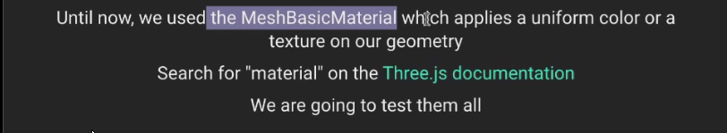<br/>
    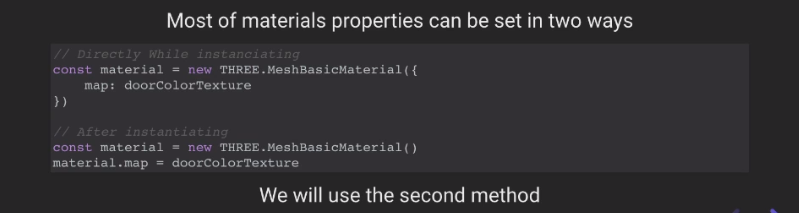<br/>
    <br/>
    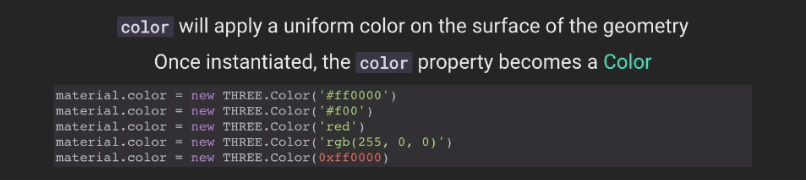<br/>
    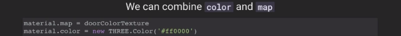<br/>
    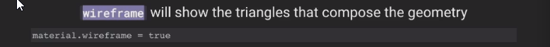<br/>
    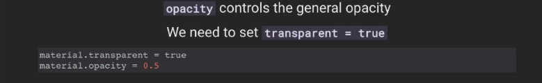<br/>
    <br/>
    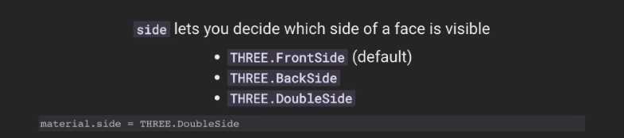<br/>
    <br /><br/>

  ```js
  const material = new THREE.MeshBasicMaterial();
  material.map = doorColorTexture;
  // material.color.set('#FF00FF')
  // material.wireframe = true

  // material.opacity = 0.5
  material.transparent = true;
  // material.alphaMap = doorAlphaTexture
  // material.side = THREE.DoubleSide
  ```

- [MeshNormalMaterial](https://threejs.org/docs/?q=material#api/en/materials/MeshNormalMaterial)
  - <br /><br/>
    <br/>
    <br/>
    <br /><br/>
- [MeshMatcapMaterial](https://threejs.org/docs/?q=material#api/en/materials/MeshMatcapMaterial)
  - <br />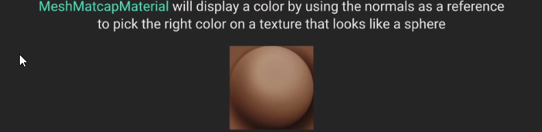<br/>
    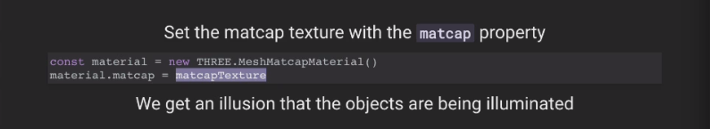<br/>
    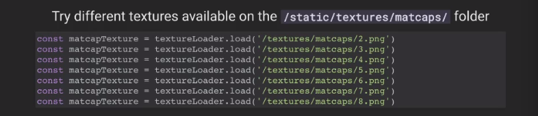<br/>
    <br /><br/>
- [MeshDepthMaterial](https://threejs.org/docs/?q=material#api/en/materials/MeshDepthMaterial)
  <br />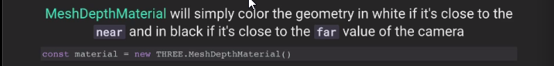<br/>
- [MeshLambertMaterial](https://threejs.org/docs/?q=material#api/en/materials/MeshLambertMaterial)

  - <br /><br/>
    <br />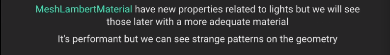<br/>

- [MeshPhongMaterial](https://threejs.org/docs/?q=material#api/en/materials/MeshPhongMaterial)
  - <br />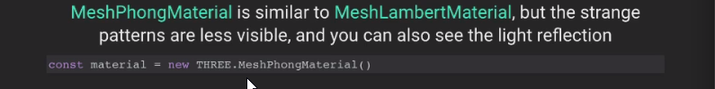<br/>
    <br/>
    <br />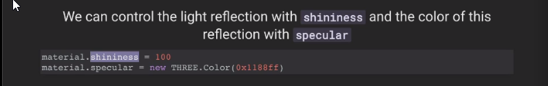<br/>
- [MeshToonMaterial](https://threejs.org/docs/?q=material#api/en/materials/MeshToonMaterial)
  - <br /><br/>
    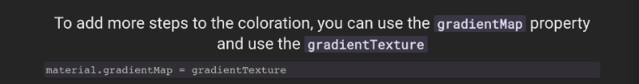<br/>
    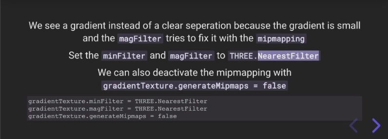<br/>
- [MeshStandardMaterial](https://threejs.org/docs/?q=material#api/en/materials/MeshStandardMaterial)

  - <br />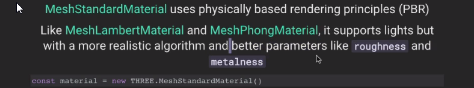<br/>
    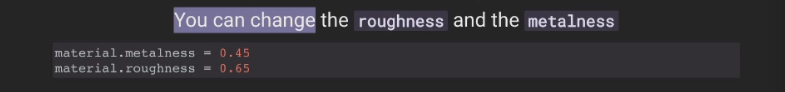<br/>
    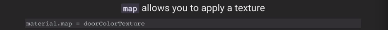<br/>
    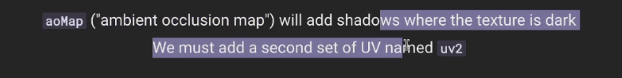<br/>
    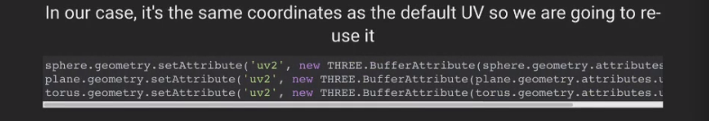<br/>

    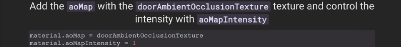<br/>
    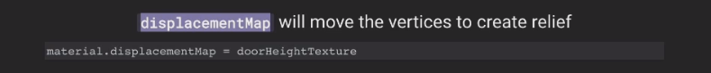<br/>
    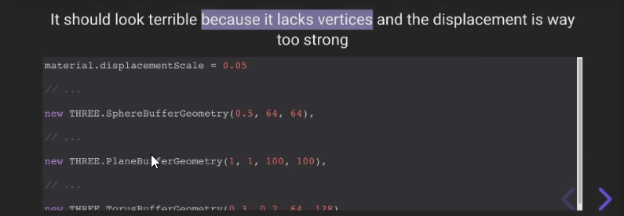<br/>
    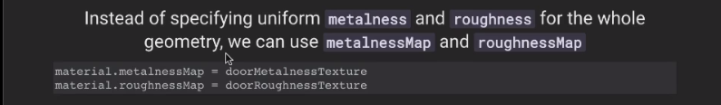<br/>
    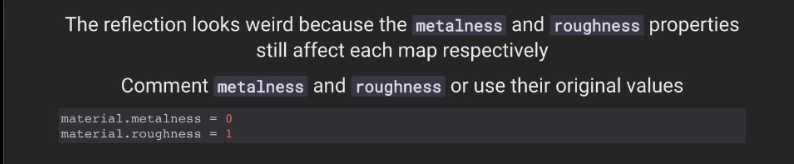<br/>
    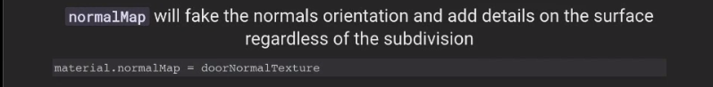<br/>
    <br/>
    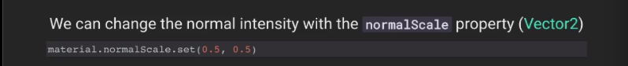<br/>
    <br/>
    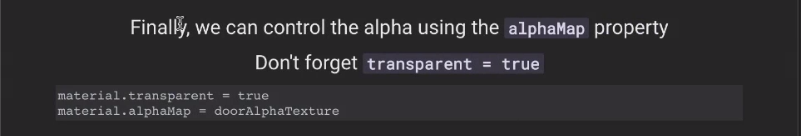<br/>

  - code
    ```js
    const material = new THREE.MeshStandardMaterial();
    // material.metalness = 0
    // material.roughness = 1
    material.map = doorColorTexture;
    material.aoMap = doorAmbientOcclusionTexture;
    material.aoMapIntensity = 1;
    material.displacementMap = doorHeightTexture;
    material.displacementScale = 0.05;
    material.metalnessMap = doorMetalnessTexture;
    material.roughnessMap = doorRoughnessTexture;
    material.normalMap = doorNormalTexture;
    material.normalScale.set(0.5, 0.5);
    material.transparent = true;
    material.alphaMap = doorAlphaTexture;

    gui.add(material, "metalness").min(0).max(1).step(0.0001);
    gui.add(material, "aoMapIntensity").min(0).max(10).step(0.0001);
    gui.add(material, "displacementScale").min(0).max(10).step(0.0001);
    gui.add(material, "roughness").min(0).max(1).step(0.0001);
    gui.add(material, "wireframe");
    gui.add(material, "transparent");
    ```
- [MeshPhysicalMaterial](https://threejs.org/docs/?q=material#api/en/materials/MeshPhysicalMaterial)
  - <br /><br/>
- [PointsMaterial](https://threejs.org/docs/?q=material#api/en/materials/PointsMaterial)
- <br /><br/>

  - <br />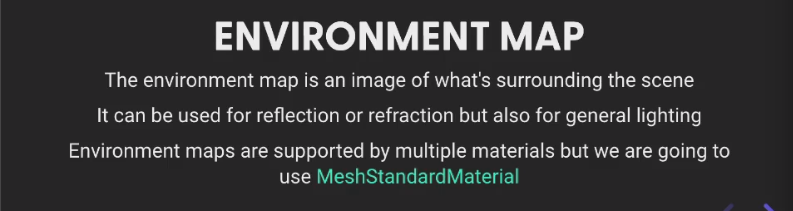<br/>
    <br/>
    <br/>
    <br/>
    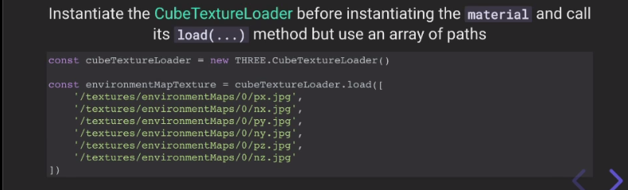<br/>

    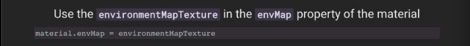<br/>
    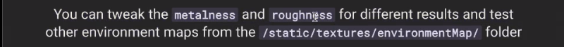<br/>
    <br/>
    <br/>

