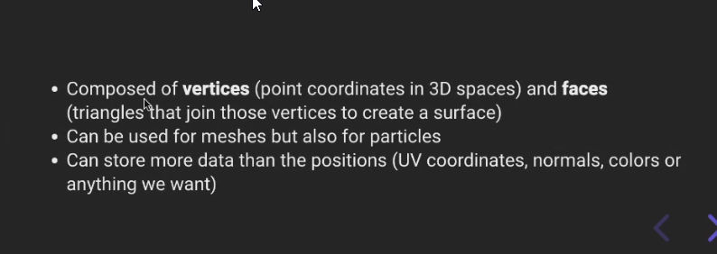
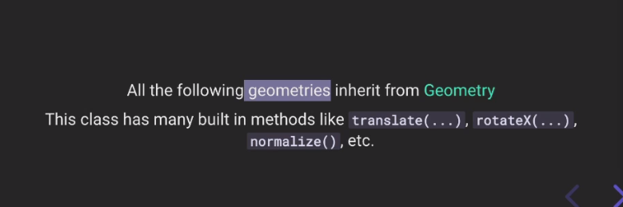
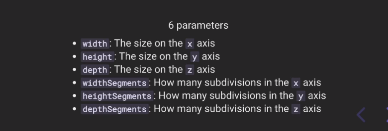
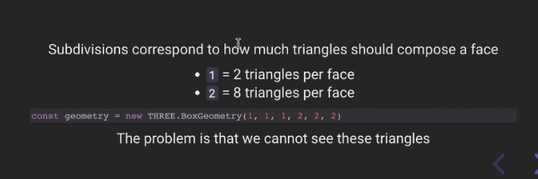
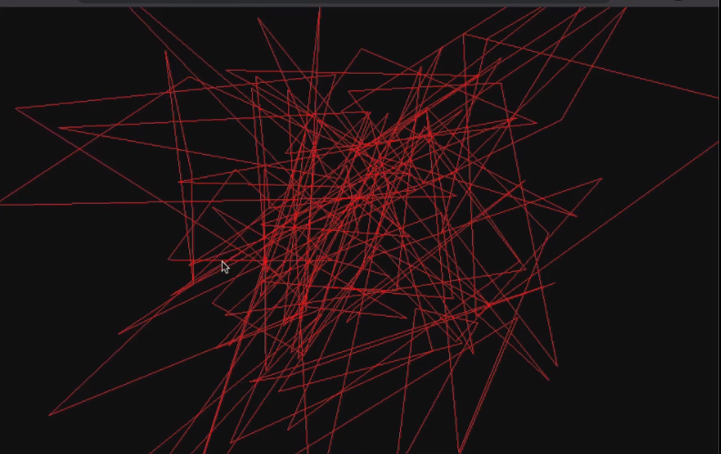

# Three.js Journey

## we created a webpack Server for three js local development

## Setup

Download [Node.js](https://nodejs.org/en/download/).
Run this followed commands:

```bash
# Install dependencies (only the first time)
npm install

# Run the local server at localhost:8080
npm run dev

# Build for production in the dist/ directory
npm run build
```

## learned about geometries

<br /><br/>
<br /><br/>
<br /><br/>

checking what geometries exist in library

- [BoxGeometry](https://threejs.org/docs/api/en/geometries/BoxGeometry.html)
  <br /><br/>
  <br /><br/><br/>
- [CapsuleGeometry](https://threejs.org/docs/api/en/geometries/CapsuleGeometry.html)
- [CircleGeometry](https://threejs.org/docs/api/en/geometries/CircleGeometry.html)
- [ConeGeometry](https://threejs.org/docs/api/en/geometries/ConeGeometry.html)
- [CylinderGeometry](https://threejs.org/docs/api/en/geometries/CylinderGeometry.html)
- [DodecahedronGeometry](BoxGeometry)
- [EdgesGeometry](https://threejs.org/docs/api/en/geometries/EdgesGeometry.html)
- [ExtrudeGeometry](https://threejs.org/docs/api/en/geometries/ExtrudeGeometry.html)
- [IcosahedronGeometry](https://threejs.org/docs/api/en/geometries/IcosahedronGeometry.html)
- [LatheGeometry](https://threejs.org/docs/api/en/geometries/LatheGeometry.html)
- [OctahedronGeometry](https://threejs.org/docs/api/en/geometries/OctahedronGeometry.html)
- [PlaneGeometry](https://threejs.org/docs/api/en/geometries/PlaneGeometry.html)
- [PolyhedronGeometry](https://threejs.org/docs/api/en/geometries/PolyhedronGeometry.html)
- [RingGeometry](https://threejs.org/docs/api/en/geometries/RingGeometry.html)
- [ShapeGeometry](https://threejs.org/docs/api/en/geometries/ShapeGeometry.html)
- [SphereGeometry](https://threejs.org/docs/api/en/geometries/SphereGeometry.html)
- [TetrahedronGeometry](https://threejs.org/docs/api/en/geometries/TetrahedronGeometry.html)
- [TorusGeometry](https://threejs.org/docs/api/en/geometries/TorusGeometry.html)
- [TorusKnotGeometry](https://threejs.org/docs/api/en/geometries/TorusKnotGeometry.html)
- [TubeGeometry](https://threejs.org/docs/api/en/geometries/TubeGeometry.html)
- [WireframeGeometry](https://threejs.org/docs/api/en/geometries/WireframeGeometry.html)


```js
......
/**
 * Object
 */

const geometry = new THREE.BufferGeometry()
const count = 50
const positionsArray = new Float32Array(count * 3 * 3)
for(let i = 0; i < count * 3 * 3; i++)
{
    positionsArray[i] = (Math.random() - 0.5) * 4
}
const positionsAttribute = new THREE.BufferAttribute(positionsArray, 3)
geometry.setAttribute('position', positionsAttribute)

const material = new THREE.MeshBasicMaterial({ color: 0xff0000, wireframe: true })

const mesh = new THREE.Mesh(geometry, material)
scene.add(mesh)
....

```

created this
<br /><br/>