# Three.js Journey

## we created a webpack Server for three js local development

## Setup

Download [Node.js](https://nodejs.org/en/download/).
Run this followed commands:

```bash
# Install dependencies (only the first time)
npm install

# Run the local server at localhost:8080
npm run dev

# Build for production in the dist/ directory
npm run build
```

## learned about [Texture](https://threejs.org/docs/#api/en/textures/Texture)

- color (or Albedon) Texture
  - <br /><br/>
  - EX: <br /><br/>
- Alpha Texture
  - <br /><br/>
  - EX: <br /><br/>
- Height (or Displacement) Texture
  - <br /><br/>
  - EX: <br /><br>
- Normal Texture
  - <br />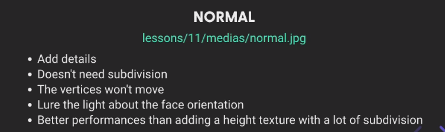<br/>
  - EX: <br /><br>
- Ambient Occlusion Texture
  - <br /><br/>
  - EX: <br />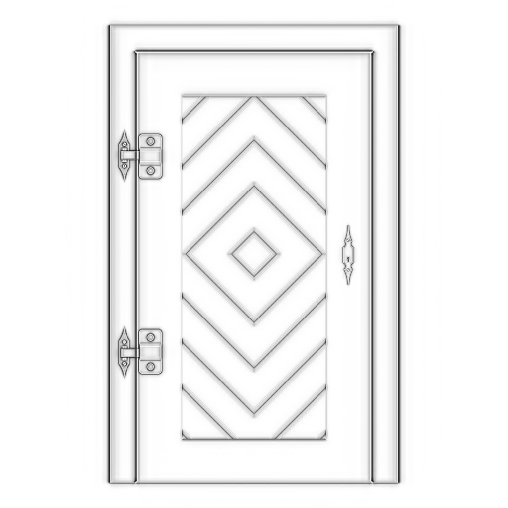<br>
- Meatless Texture
  - <br /><br/>
  - EX: <br /><br>
- Roughness Texture
  - <br /><br/>
  - EX: <br />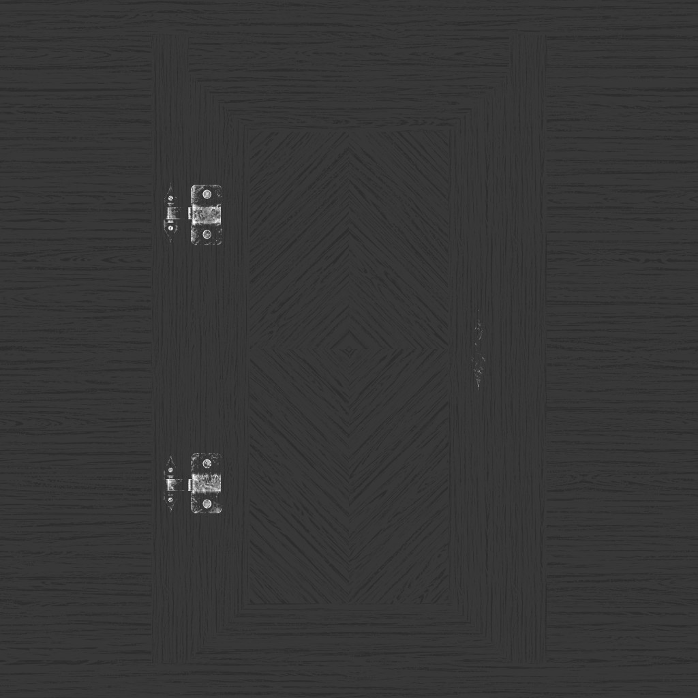<br>

Above are the most used type of Texture and those follow PBR

What is PBR
<br />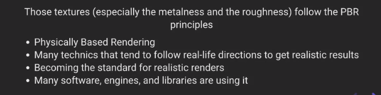<br>

blog link regarding this

https://marmoset.co/posts/physically-based-rendering-and-you-can-too/

https://marmoset.co/posts/basic-theory-of-physically-based-rendering/

## How to Load Textures

- Loading image (This process will work for our webpack setup)

  - We will put all of our image in our `static` folder
  - in ths case we can access our resource like

    ```js
    const imgSource = "/image.pmg";
    console.log(imgSource);
    ```

  - load image

    ```js
    const image = new Image();
    image.onload(() => {
      console.log("image loader");
    });
    image.src = "/textures/door/alpha.jpg";
    ```

  - load image texture

    ```js
    /** load image texture*/

    const image = new Image();
    const texture = new THREE.Texture(image);
    image.onload(() => {
      console.log("image loader");
      texture.needsUpdate = true; // texture will bee updated because of this command
    });
    image.src = "/textures/door/alpha.jpg";
    /**
     * Object
     */
    const geometry = new THREE.BoxGeometry(1, 1, 1);
    console.log(geometry.attributes);
    const material = new THREE.MeshBasicMaterial({ map: texture });
    const mesh = new THREE.Mesh(geometry, material);
    scene.add(mesh);
    ```

  - Use texture Loader

    ```js
    const textureLoader = new THREE.TextureLoader();
    const alphaTexture = textureLoader.load("/textures/door/alpha.jpg");
    ```

  - We can use bellow callback to debug texture Loader issue

    ```js
    const textureLoader = new THREE.TextureLoader(loadingManager);
    const colorTexture = textureLoader.load(
      "/textures/minecraft.png",
      () => {
        console.log("textureLoader: loading finished");
      },
      () => {
        console.log("textureLoader: loading progressing");
      },
      () => {
        console.log("textureLoader: loading error");
      }
    );
    ```

  - how to use loadingManager, it can be use to manage different type of loader

    ```js
    const loadingManager = new THREE.LoadingManager();
    loadingManager.onStart = () => {
      console.log("loadingManager: loading started");
    };
    loadingManager.onLoad = () => {
      console.log("loadingManager: loading finished");
    };
    loadingManager.onProgress = () => {
      console.log("loadingManager: loading progressing");
    };
    loadingManager.onError = () => {
      console.log("loadingManager: loading error");
    };
    const textureLoader = new THREE.TextureLoader(loadingManager);
    const colorTexture = textureLoader.load("/textures/minecraft.png");
    ```

## UV unwrapping

It defines how the texture is rapping the Geometry

<br /><br/>

visual example:-

<br />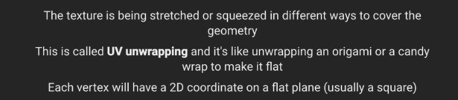<br/>
<br />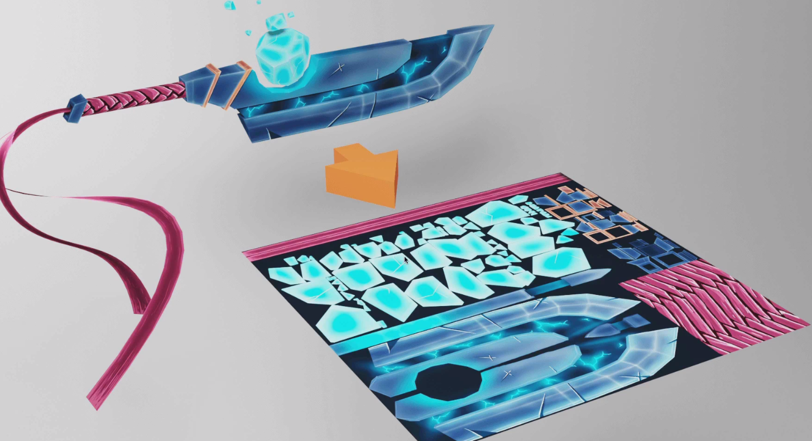<br/>

you can check uv object by logging `console.log(geometry.attributes.uv)`

<br />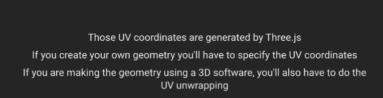<br/>

## Reansforming The Texture

you can check generateMipmaps, offset, repeat and soon in the video to get batter idea `time stamp  00:40:20 -  00:29:40`

- repeat

  - <br />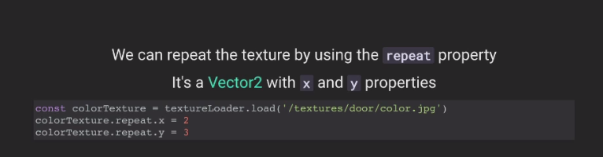<br/>
  - <br />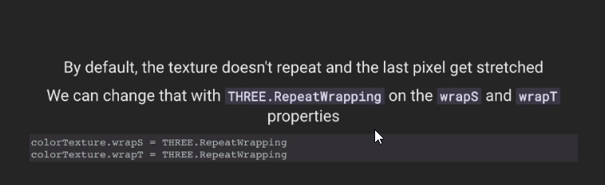<br/>
  - <br />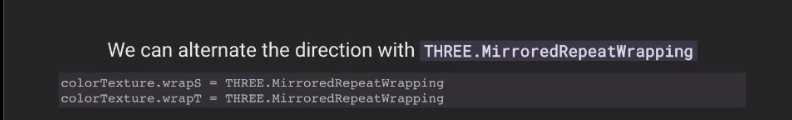<br/>

- OffSet

  - <br />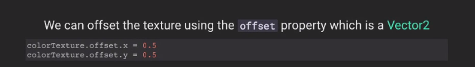<br/>
  - <br />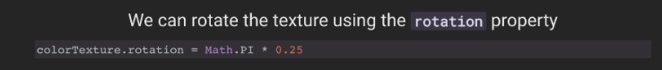<br/>

- repeat and OffSet
  - <br />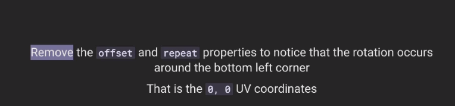<br/>
  - <br />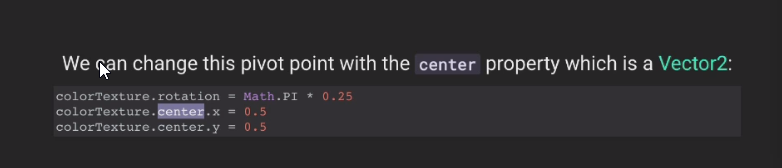<br/>
  - <br />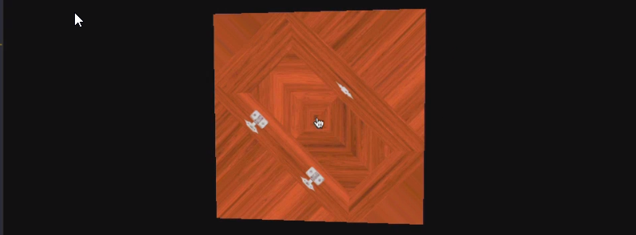<br/>

## Filtering and Mip-maping

time stamp 00:29:40 - 1:02:00

<br />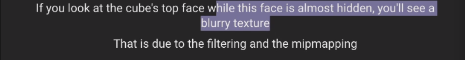<br/>

<br />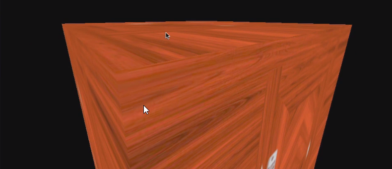<br/>
<br />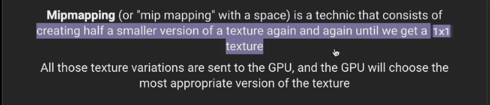<br/>

Minafication Filter

- <br />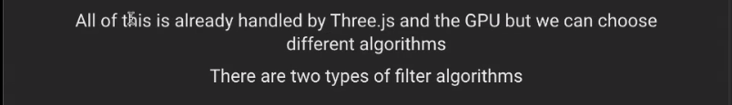<br/>
- <br />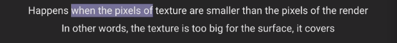<br/>
- <br />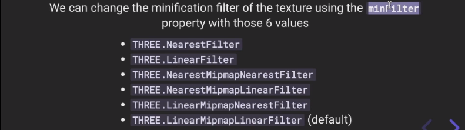<br/>

Texcher ForMate And Optimization

<br />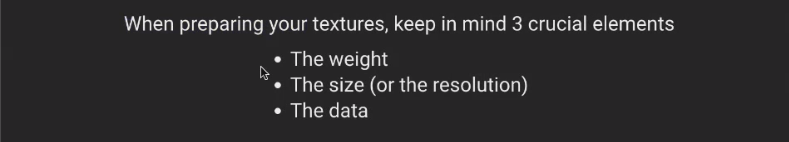<br/>

- Wight
  - <br />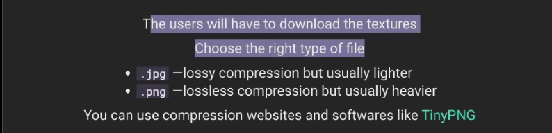<br/>
- the size
  - <br />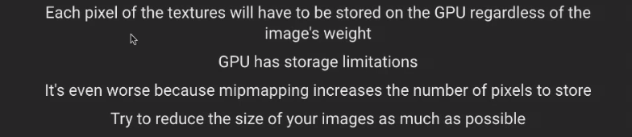<br/>
  - <br />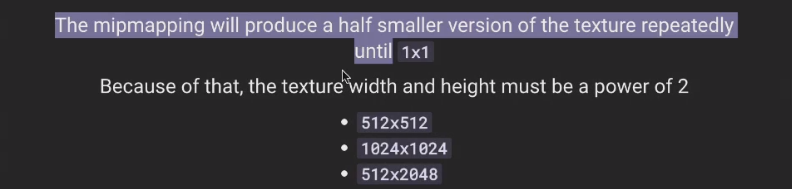<br/>
- data

  - <br />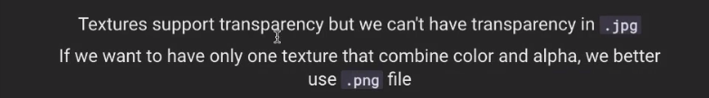<br/>
  - <br />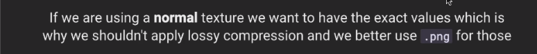<br/>
  - <br />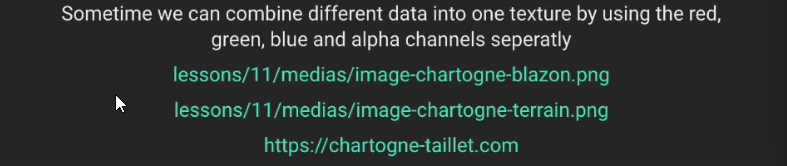<br/>
  - <br />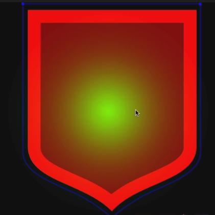<br/>
  - <br /><br/>

Where to find texture

- <br />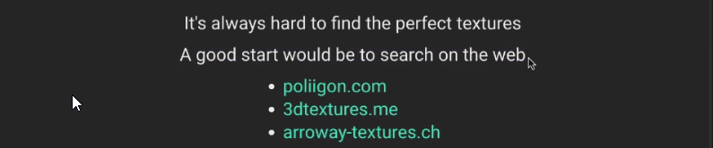<br/>
