# Three.js Journey

## we created a webpack Server for three js local development

## Setup

Download [Node.js](https://nodejs.org/en/download/).
Run this followed commands:

```bash
# Install dependencies (only the first time)
npm install

# Run the local server at localhost:8080
npm run dev

# Build for production in the dist/ directory
npm run build
```

## learned about [Shadows](https://threejs.org/docs/index.html?q=shadow#api/en/lights/shadows/LightShadow)

check the code

<br/>
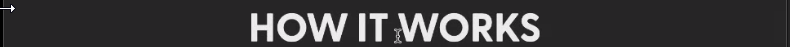<br/>
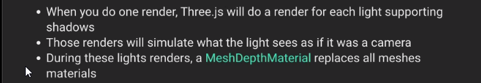<br/>
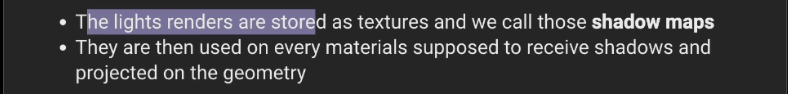<br/>

example: [click to see 'webgl_shadowmap_viewer'](https://threejs.org/examples/?q=shadow#webgl_shadowmap_viewer)

we have below item present on the default scene
<br/><br/>


## How to Activate Shadow Map

<br/>
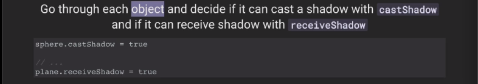<br/>
<br/>
<br/>
<br/>
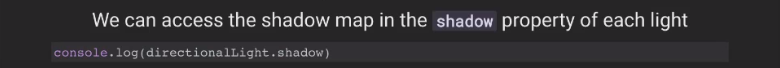<br/>
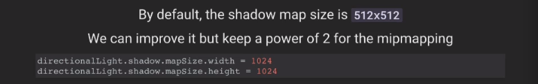<br/>
<br/>
<br/>
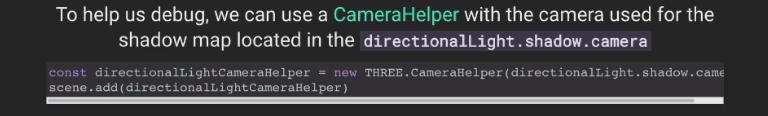<br/>
<br/>
<br/>
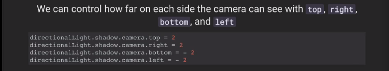<br/>


<br/><br/>
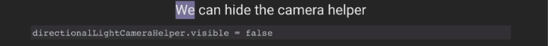<br/>
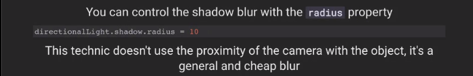<br/>
<br/>
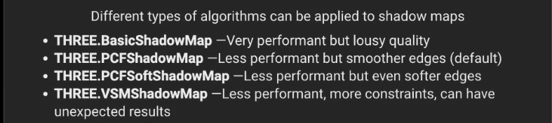<br/>
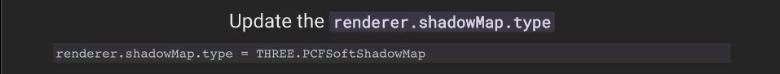<br/>
<br/>
<br/>
<br/>
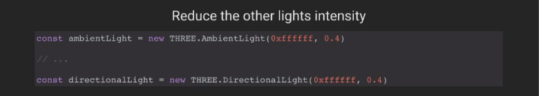<br/>
<br/>
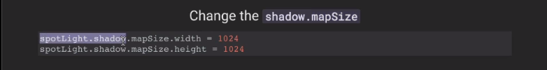<br/>
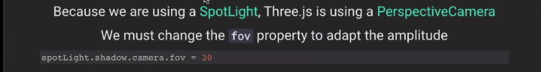<br/>
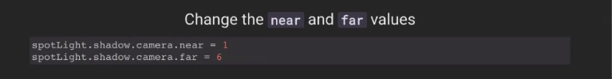<br/>
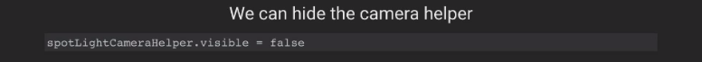<br/>

<br/>
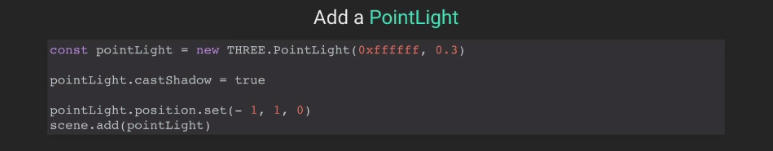<br/>
<br/>
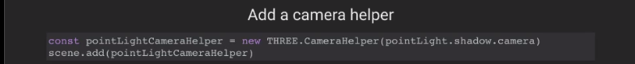<br/>
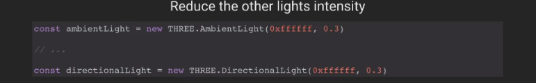<br/>
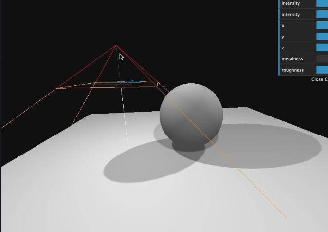<br/>
<br/>
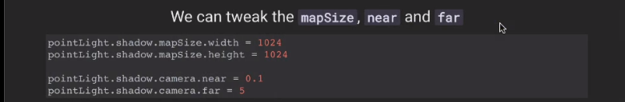<br/>
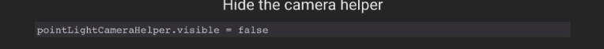<br/>


<br/>
<br/>
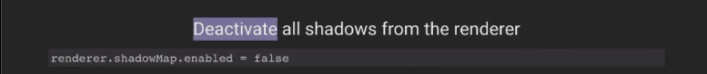<br/>
<br/>
<br/>
<br/>
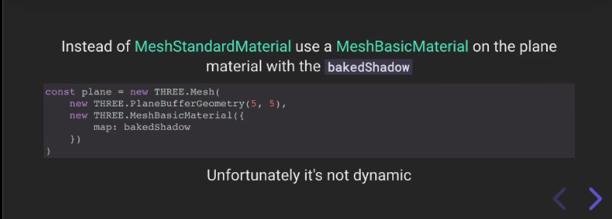<br/>


<br/>
<br/>
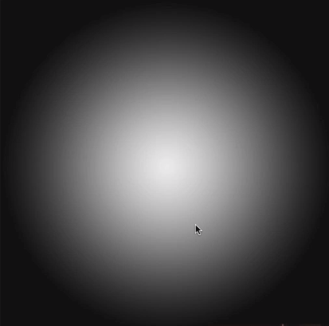<br/>
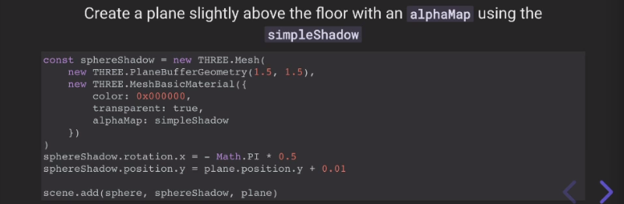<br/>
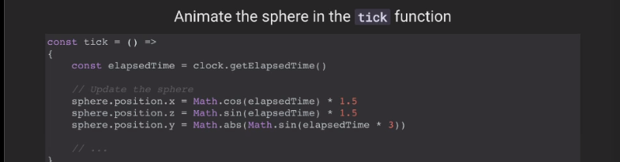<br/>
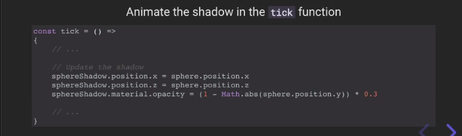<br/>
<br/>
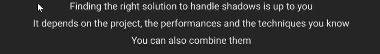<br/>