# Three.js Journey

## we created a webpack Server for three js local development

## Setup

Download [Node.js](https://nodejs.org/en/download/).
Run this followed commands:

```bash
# Install dependencies (only the first time)
npm install

# Run the local server at localhost:8080
npm run dev

# Build for production in the dist/ directory
npm run build
```

## learned about [Particles](https://threejs.org/docs/index.html?q=Points#api/en/objects/Points)

<br />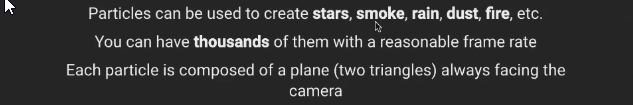<br/>
<br /><br/>
<br /><br/>
<br />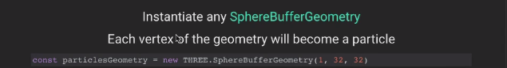<br/>
<br /><br/>
<br />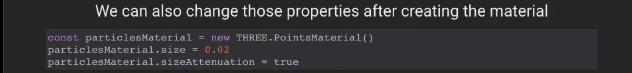<br/>
<br />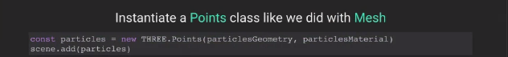<br/>
<br /><br/>
<br />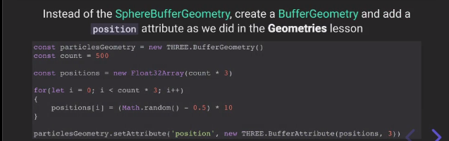<br/>
<br /><br/>
<br />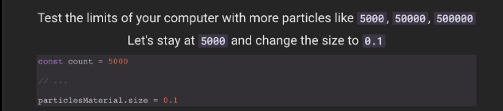<br/>
<br /><br/>
<br />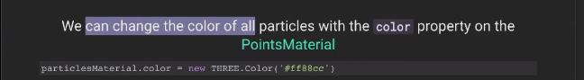<br/>
<br />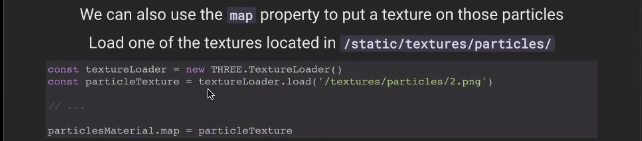<br/>
<br /><br/>
<br />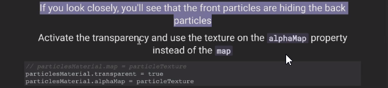<br/>
<br />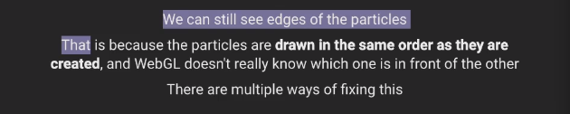<br/>
<br /><br/>
<br />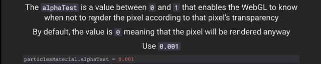<br/>
<br />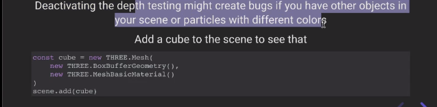<br/>
<br /><br/>
<br />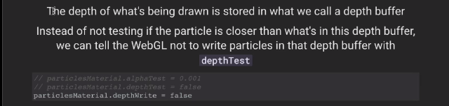<br/>
<br />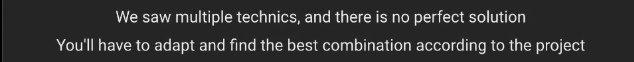<br/>
<br /><br/>
<br />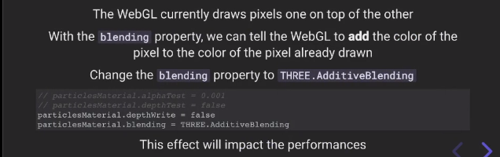<br/>
<br /><br/>
<br />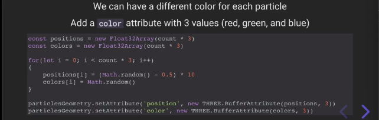<br/>
<br />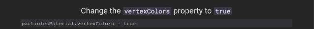<br/>
<br />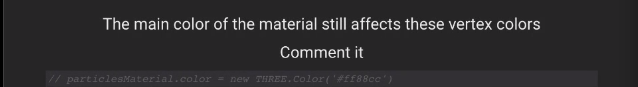<br/>
<br /><br/>
<br />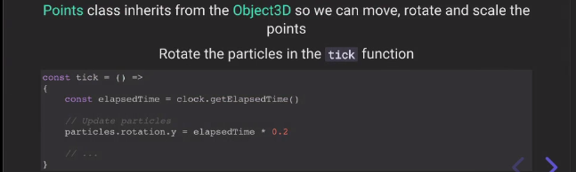<br/>
<br /><br/>
<br />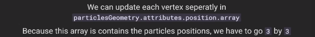<br/>
<br />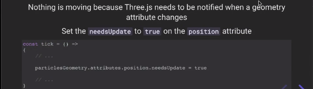<br/>
<br /><br/>
<br /><br/>
<br /><br/>


check the code