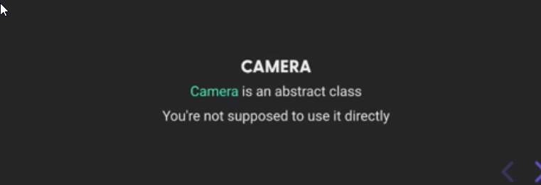
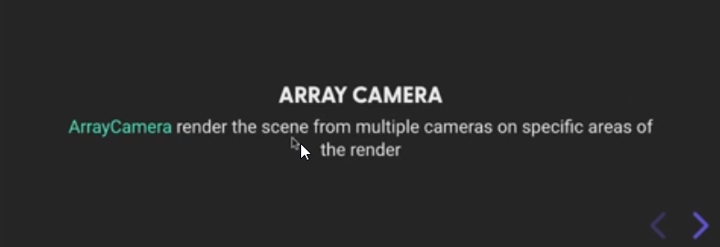
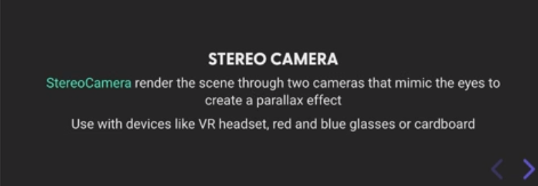
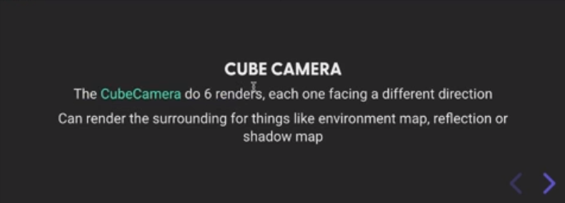
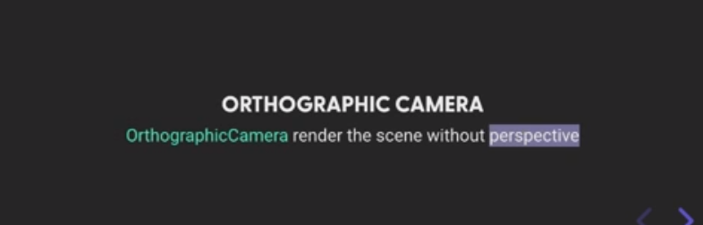
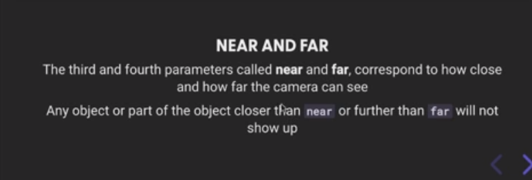

# Three.js Journey

## we created a webpack Server for three js local development

## Setup

Download [Node.js](https://nodejs.org/en/download/).
Run this followed commands:

```bash
# Install dependencies (only the first time)
npm install

# Run the local server at localhost:8080
npm run dev

# Build for production in the dist/ directory
npm run build
```

## learned about Camera, PerspectiveCamera and OrthographicCamera etc

<br />

## [ArrayCamera](https://threejs.org/docs/?q=arrayc#api/en/cameras/ArrayCamera)

<br />

ArrayCamera can be used in order to efficiently render a scene with a predefined set of cameras. This is an important performance aspect for rendering VR scenes.
An instance of ArrayCamera always has an array of sub cameras. It's mandatory to define for each sub camera the viewport property which determines the part of the viewport that is rendered with this camera.

ex: [camera / array ](https://threejs.org/examples/#webgl_camera_array)

## [StereoCamera](https://threejs.org/docs/?q=stereo#api/en/cameras/StereoCamera)

<br />

Dual PerspectiveCameras used for effects such as 3D Anaglyph or Parallax Barrier.

ex:
[effects / anaglyph](https://threejs.org/examples/#webgl_effects_anaglyph)
[effects / parallaxbarrier](https://threejs.org/examples/#webgl_effects_parallaxbarrier)
[effects / stereo ](https://threejs.org/examples/#webgl_effects_anaglyph)

## [CubeCamera](https://threejs.org/docs/?q=cube#api/en/cameras/CubeCamera)

<br />

Creates 6 cameras that render to a WebGLCubeRenderTarget.

ex:
[materials / cubemap / dynamic ](https://threejs.org/examples/#webgl_materials_cubemap_dynamic)

## [OrthographicCamera](https://threejs.org/docs/?q=orthographic#api/en/cameras/OrthographicCamera)

<br />

Camera that uses orthographic projection.

In this projection mode, an object's size in the rendered image stays constant regardless of its distance from the camera.

This can be useful for rendering 2D scenes and UI elements, amongst other things.

ex: code

```javascript
const camera = new THREE.OrthographicCamera(
  width / -2,
  width / 2,
  height / 2,
  height / -2,
  1,
  1000
);
scene.add(camera);
```

Constructor

    OrthographicCamera( left : Number, right : Number, top : Number, bottom : Number, near : Number, far : Number )

    left — Camera frustum left plane.
    right — Camera frustum right plane.
    top — Camera frustum top plane.
    bottom — Camera frustum bottom plane.
    near — Camera frustum near plane.
    far — Camera frustum far plane.

## [PerspectiveCamera](https://threejs.org/docs/index.html?q=pers#api/en/cameras/PerspectiveCamera)

<!-- <br /> -->

Camera that uses perspective projection.

This projection mode is designed to mimic the way the human eye sees. It is the most common projection mode used for rendering a 3D scene.

ex: code

```javascript
const camera = new THREE.PerspectiveCamera(45, width / height, 1, 1000);
scene.add(camera);
```

Constructor

    PerspectiveCamera( fov : Number, aspect : Number, near : Number, far : Number )

    fov — Camera frustum vertical field of view. its in degree
    aspect — Camera frustum aspect ratio.
    near — Camera frustum near plane. ⚠️ don't use loo value like 0.000. it will glitche
    far — Camera frustum far plane. ⚠️ don't use loo value like 9999.. glitche

<br />

## Camera Movement using mouse

```javascript
// Cursor
const cursor = {
  x: 0,
  y: 0,
};
// update mouse courser codelens
window.addEventListener("mousemove", (event) => {
  cursor.x = event.clientX / sizes.width - 0.5;
  cursor.y = -(event.clientY / sizes.height - 0.5);
});
```

update camera position by mouse movement

```javascript
const tick = () => {
  const elapsedTime = clock.getElapsedTime();

  //update camera position by mouse movement
  camera.position.y = cursor.y * 3;
  camera.position.x = cursor.x * 3;
  camera.lookAt(mash.position);

  // Render
  renderer.render(scene, camera);

  // Call tick again on the next frame
  window.requestAnimationFrame(tick);
};

tick();
```

update camera in a circle

```javascript
const tick = () => {
  const elapsedTime = clock.getElapsedTime();

  //update camera in a circle
  camera.position.y = Math.sin(cursor.y * Math.PI * 2) * 3;
  camera.position.x = Math.cos(cursor.x * Math.PI * 2) * 3;
  camera.position.y = cursor.y * 5;
  camera.lookAt(mash.position);

  // Render
  renderer.render(scene, camera);

  // Call tick again on the next frame
  window.requestAnimationFrame(tick);
};

tick();
```

## Camera Movement using Build-in Controls

Controls list

- [ArcballControls](https://threejs.org/docs/examples/en/controls/ArcballControls.html)
- [DragControls](https://threejs.org/docs/examples/en/controls/DragControls.html)
- [FirstPersonControls](https://threejs.org/docs/examples/en/controls/FirstPersonControls.html)
- [FlyControls](https://threejs.org/docs/examples/en/controls/FlyControls.html)
- [MapControls](https://threejs.org/docs/examples/en/controls/MapControls.html)
- [OrbitControls](https://threejs.org/docs/examples/en/controls/OrbitControls.html)
- [PointerLockControls](https://threejs.org/docs/examples/en/controls/PointerLockControls.html)
- [TrackballControls](https://threejs.org/docs/examples/en/controls/TrackballControls.html)
- [TransformControls](https://threejs.org/docs/examples/en/controls/TransformControls.html)

tested [OrbitControls](https://threejs.org/docs/examples/en/controls/OrbitControls.html)

```javascript

...
// Controls
const controls = new OrbitControls(camera, canvas);
controls.enableDamping = true;
...
const tick = () => {
  const elapsedTime = clock.getElapsedTime();


   // Update controls
  controls.update();
  camera.lookAt(mash.position);

  // Render
  renderer.render(scene, camera);

  // Call tick again on the next frame
  window.requestAnimationFrame(tick);
};

tick();
```