# Three.js Journey

## we created a webpack Server for three js local development

## Setup

Download [Node.js](https://nodejs.org/en/download/).
Run this followed commands:

```bash
# Install dependencies (only the first time)
npm install

# Run the local server at localhost:8080
npm run dev

# Build for production in the dist/ directory
npm run build
```

## learned about [Light](https://threejs.org/docs/index.html?q=light#)

check the code

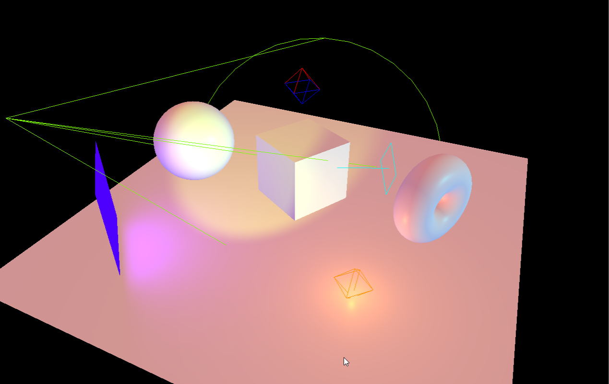<br/>


## different Type of light

- [AmbientLight](https://threejs.org/docs/index.html?q=light#api/en/lights/AmbientLight)
    - 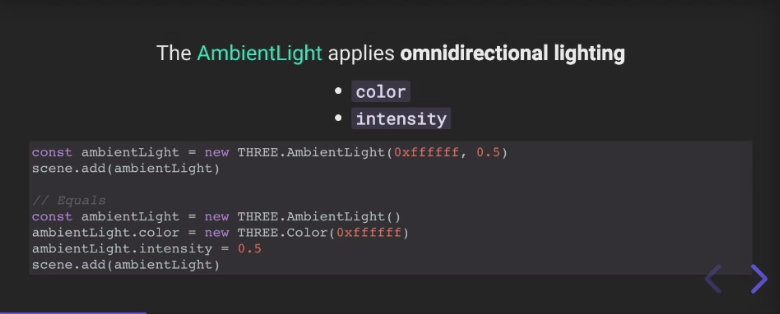<br/>
    - 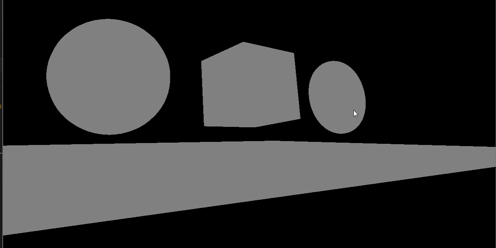<br/>
    - 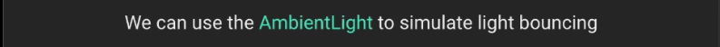<br/>
- [DirectionalLight](https://threejs.org/docs/index.html?q=light#api/en/lights/DirectionalLight)
    - 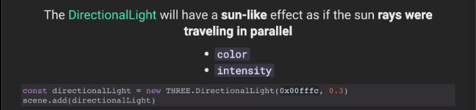<br/>
    - <br/>
    - <br/>
- [HemisphereLight](https://threejs.org/docs/index.html?q=light#api/en/lights/HemisphereLight)
    - 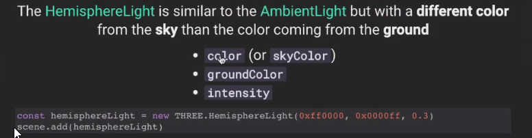<br/>
    - 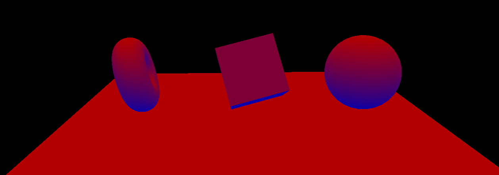<br/>
    - 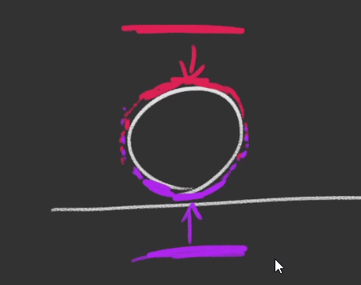<br/>
    - 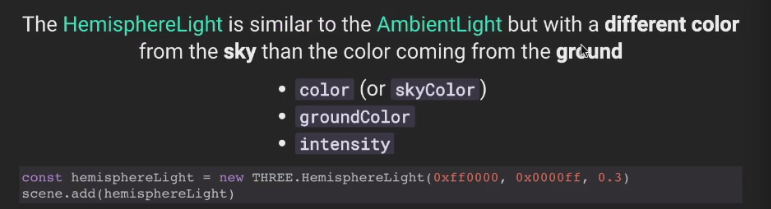<br/>

- [PointLight](https://threejs.org/docs/index.html?q=light#api/en/lights/PointLight)
    - 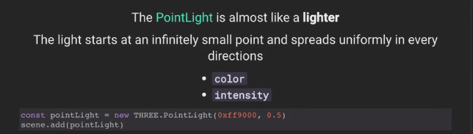<br/>
    - 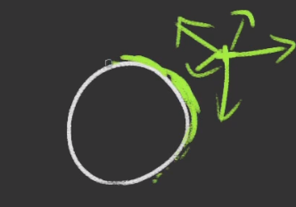<br/>
    - 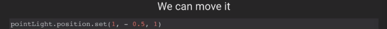<br/>
    - 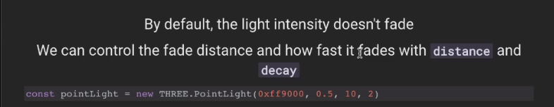<br/>
    - <br/>
- [RectAreaLight](https://threejs.org/docs/index.html?q=light#api/en/lights/RectAreaLight)
    - 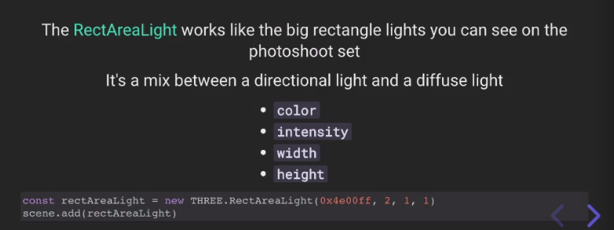<br/>
    - <br/>
    - 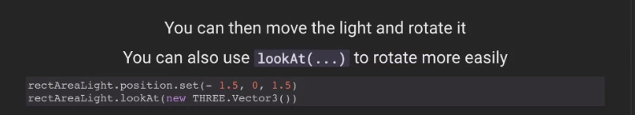<br/>
    - 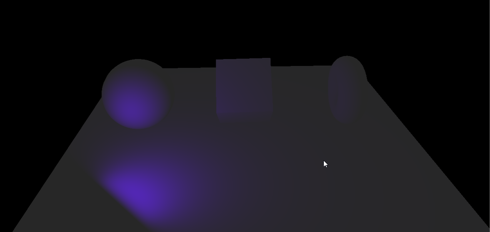<br/>
- [SpotLight](https://threejs.org/docs/index.html?q=light#api/en/lights/SpotLight)
    - 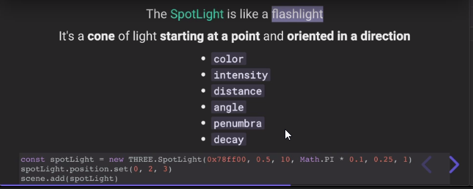<br/>
    - 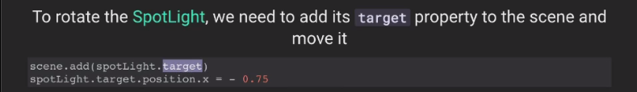<br/>


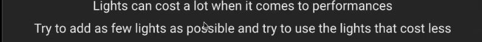<br/>
<br/>
<br/>
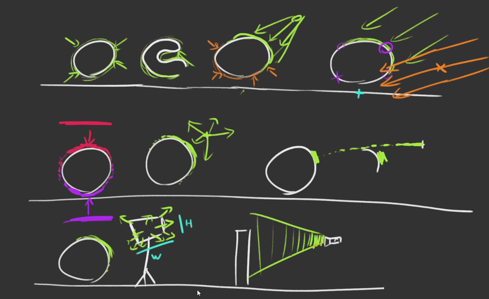<br/>


Baking 

- 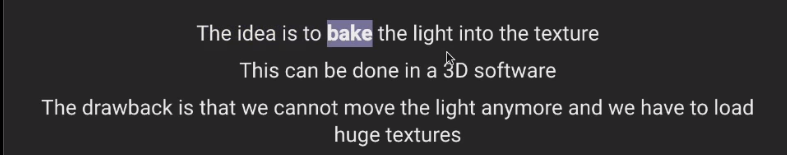<br/>

<br/><br/>

```js
// Helpers
const hemisphereLightHelper = new THREE.HemisphereLightHelper(hemisphereLight, 0.2)
scene.add(hemisphereLightHelper)

const directionalLightHelper = new THREE.DirectionalLightHelper(directionalLight, 0.2)
scene.add(directionalLightHelper)

const pointLightHelper = new THREE.PointLightHelper(pointLight, 0.2)
scene.add(pointLightHelper)

const spotLightHelper = new THREE.SpotLightHelper(spotLight)
scene.add(spotLightHelper)
window.requestAnimationFrame(() =>
{
    spotLightHelper.update()
})

const rectAreaLightHelper = new RectAreaLightHelper(rectAreaLight)
scene.add(rectAreaLightHelper)
```