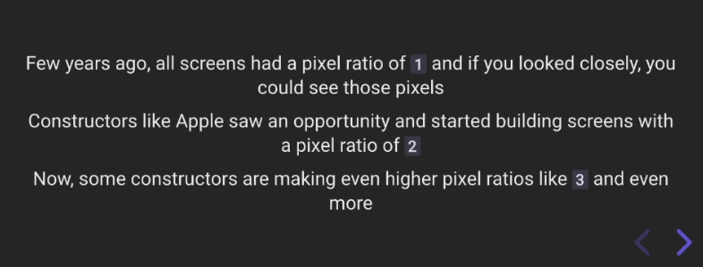
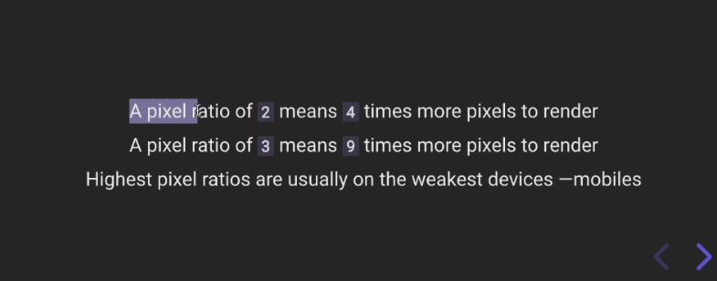

# Three.js Journey

## we created a webpack Server for three js local development

## Setup

Download [Node.js](https://nodejs.org/en/download/).
Run this followed commands:

```bash
# Install dependencies (only the first time)
npm install

# Run the local server at localhost:8080
npm run dev

# Build for production in the dist/ directory
npm run build
```

## learned about fullscreen and resizing window

update  canvas size, when we change our browser window

```js
/**
 * Sizes
 */
const sizes = {
  width: window.innerWidth,
  height: window.innerHeight,
};
// update  canvas size, when we change our browser window
window.addEventListener("resize", () => {
  // Update sizes
  sizes.width = window.innerWidth;
  sizes.height = window.innerHeight;

  // Update camera
  camera.aspect = sizes.width / sizes.height;
  camera.updateProjectionMatrix();

  // Update renderer
  renderer.setSize(sizes.width, sizes.height);
  renderer.setPixelRatio(Math.min(window.devicePixelRatio, 2));
});
```

enable full screen on double tab

```js
/**
 * Fullscreen
 */
window.addEventListener('dblclick', () =>
{
    const fullscreenElement = document.fullscreenElement || document.webkitFullscreenElement

    if(!fullscreenElement)
    {
        if(canvas.requestFullscreen)
        {
            canvas.requestFullscreen()
        }
        else if(canvas.webkitRequestFullscreen)
        {
            canvas.webkitRequestFullscreen()
        }
    }
    else
    {
        if(document.exitFullscreen)
        {
            document.exitFullscreen()
        }
        else if(document.webkitExitFullscreen)
        {
            document.webkitExitFullscreen()
        }
    }
})
```

## new thing we learn

- update canvas size using `renderer.setSize(sizes.width, sizes.height)`
- camera.updateProjectionMatrix()<br /><br /><br />
- resize addEventListener
- window.devicePixelRatio is used to get the current pixel Ratio
    <br />
    <br /><br /><br />
- document.fullscreenElement

