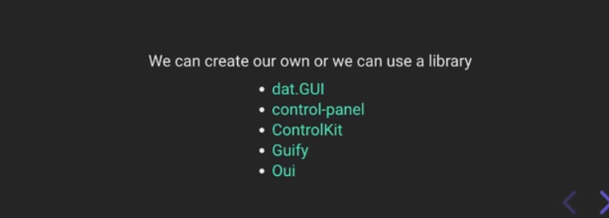
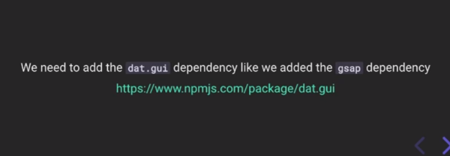
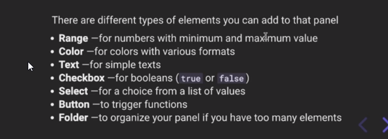

# Three.js Journey

## we created a webpack Server for three js local development

## Setup

Download [Node.js](https://nodejs.org/en/download/).
Run this followed commands:

```bash
# Install dependencies (only the first time)
npm install

# Run the local server at localhost:8080
npm run dev

# Build for production in the dist/ directory
npm run build
```

## learned about debug ui

## some popular Debug UI library
<br /><br/>

## Here we will try dot.GUI

how to setup dot.GUI

- <br/>
- `https://www.npmjs.com/package/dat.gui` 
    - import * as dat from 'dat.gui';
    - const gui = new dat.GUI()
- <br/>
- press `H` to hide

instade of 'dat.gui' we can use lil-gui it is updated